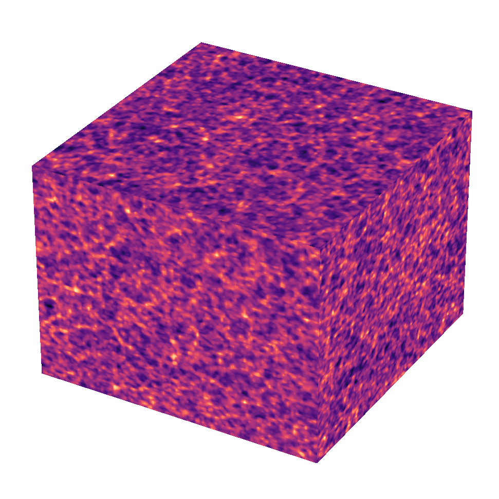
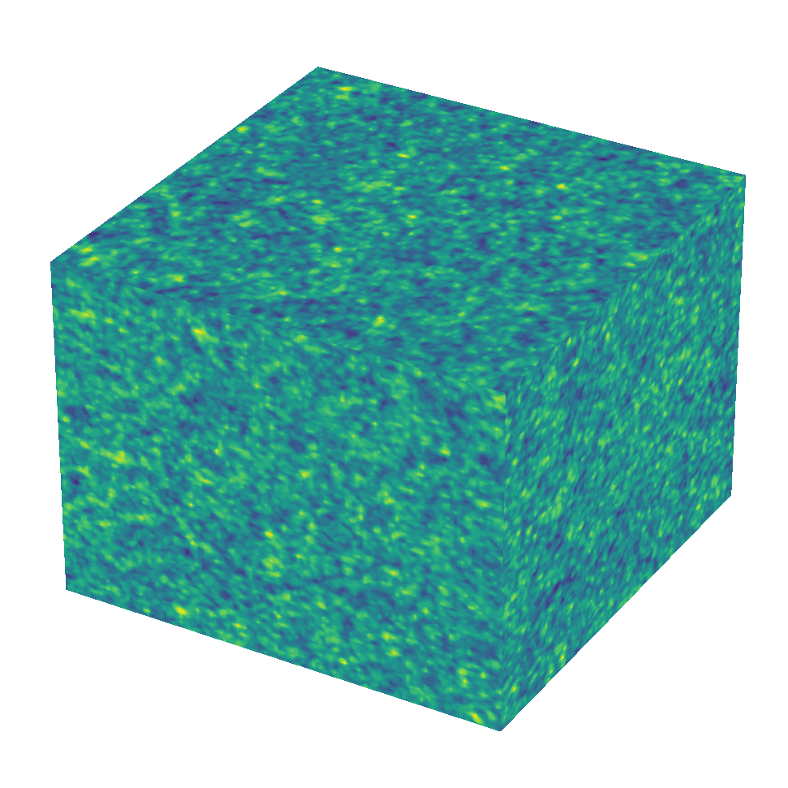
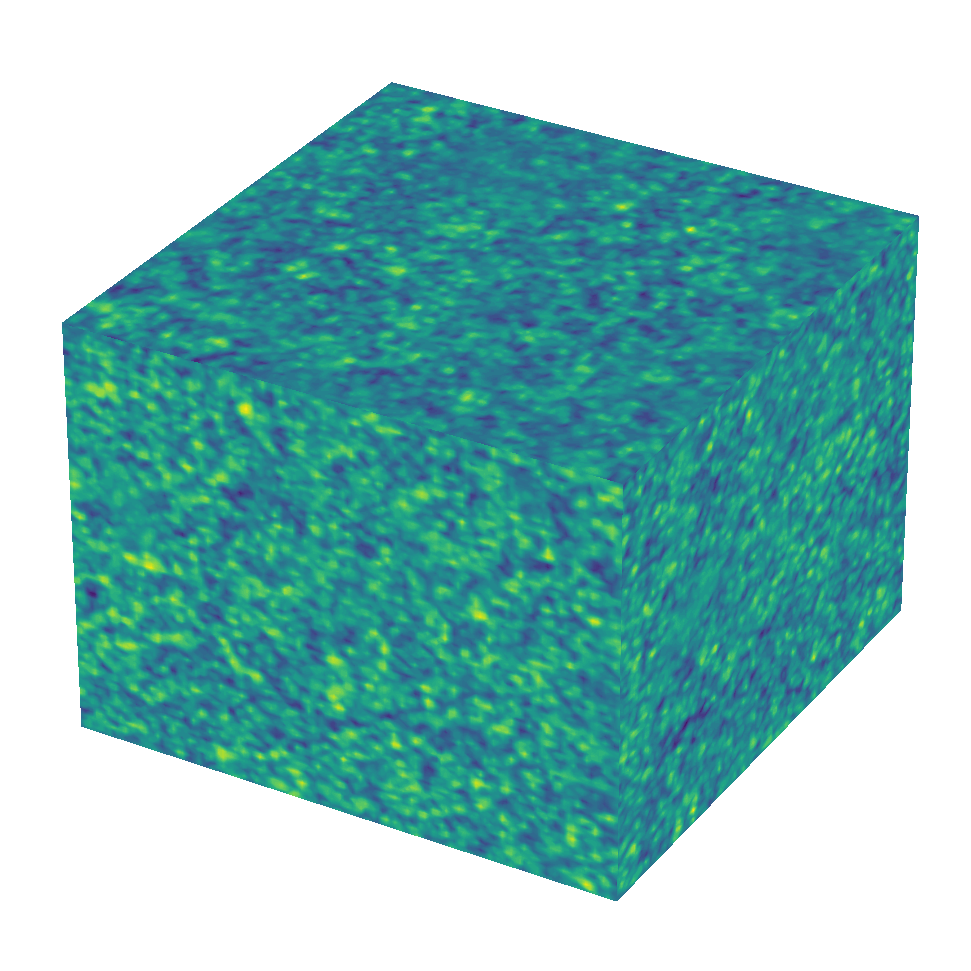

# Cosmo3DFlow: Wavelet Flow Matching for Spatial-to-Spectral Compression in Reconstructing the Early Universe

[](https://kdd.org/kdd2026/)
[](https://arxiv.org/abs/2602.10172)
[](LICENSE)
[](https://python.org)

> **KDD '26** — ACM SIGKDD Conference on Knowledge Discovery and Data Mining  
> August 9–13, 2026 · Jeju, Republic of Korea

---

## Overview

Reconstructing the early Universe from its present-day evolved state is a high-dimensional inverse problem at the frontier of modern astrophysics. Cosmo3DFlow is a generative framework that combines **3D Discrete Wavelet Transform (DWT)** with **flow matching** to attack the two core bottlenecks in cosmological inference: *dimensionality* and *sparsity*.

The key insight is the **void problem**: ~63.7% of the cosmic volume is empty voids containing only 16.2% of the dark matter mass, yet diffusion models in voxel space spend equal compute on every voxel. The wavelet transform converts spatial emptiness into spectral sparsity — voids collapse to near-zero high-frequency coefficients — concentrating computation on the physically meaningful filaments and halos.

  

Left to right: observation at z = 0 · ground truth initial conditions at z = 127 · Cosmo3DFlow reconstruction

---

## Key Results

| Metric | Cosmo3DFlow | Diffusion Baseline |
|---|---|---|
| Sampling time @ 128³ | **5.2 s** | 243 s |
| VRMSE @ 128³ (Standard LH) | **0.50** | 0.63 |
| Cross-correlation @ 128³ | **0.88** | 0.82 |
| Power spectrum R² @ 128³ | **0.99** | 0.70 |
| Peak memory @ 128³ | **2.1 GB** | 4.0 GB |
| Overall speedup | **50×** | — |

The 50× speedup comes from two compounding factors: **10× fewer ODE integration steps** (deterministic flow matching vs. stochastic diffusion) combined with **5× lower per-step cost** from the 8× spatial compression of the wavelet transform.

---

## The Void Problem


*Left:* A voxel grid allocates compute uniformly — 1.3 million of 2.1 million voxels at 128³ resolution describe near-empty void regions.  
*Right:* The wavelet representation adapts to structure. Voids are encoded by a handful of coarse approximation coefficients; filaments and halos receive dense, fine-grained detail coefficients.

---

## Method

### Wavelet Flow Matching

Flow matching learns a velocity field `v_θ` that transports samples from a Gaussian prior to the target distribution by solving an ODE. Cosmo3DFlow operates **entirely in wavelet space**:

1. **Transform** — apply 3D Haar DWT to both the noisy initial conditions and the conditioning observation, yielding 8 coefficient tensors at half the spatial resolution (8× compression).
2. **Interpolate** — form the flow path `w̃_t = t·w̃₁ + (1-t)·w̃₀` in wavelet space.
3. **Train** — minimize the wavelet-space flow matching loss plus a power spectrum regularizer:

```
ℒ_flow  = E[ ‖v_θ(w̃_t, t, ỹ) − (w̃₁ − w̃₀)‖² ]
ℒ_PS    = Σᵢ (log P_pred(kᵢ) − log P_target(kᵢ))²
ℒ_total = ℒ_flow + 0.01 · ℒ_PS
```

4. **Sample** — integrate `v_θ` with 100 Euler steps in wavelet space, then apply IDWT to recover the initial density field.

### Wavelet-Aware 3D U-Net

The velocity network takes 16 input channels (8-channel wavelet noise + 8-channel conditioning) and predicts the 8-channel velocity field. Key architectural innovations:

- **Scale-specific conditioning** — injects per-level wavelet features via 1×1×1 convolutions at each U-Net resolution, giving the model direct access to multi-scale structure information.
- **Cross-scale skip connections** — learned 1×1×1 projections that bridge encoder features directly to decoder levels, maintaining coherent scale relationships through generation.
- **BigGAN-style residual blocks** with Group Normalization, SiLU activations, and Gaussian Fourier time embeddings.
- Encoder downsamples to a fixed **8³ bottleneck** (2, 3, or 4 levels for 32³, 64³, 128³ resolutions).

### Training

```
Optimizer:     AdamW,  lr = 1e-4
LR schedule:   ReduceLROnPlateau (patience=5, factor=0.5)
Grad clipping: max norm 1.0
EMA decay:     0.999
Epochs:        100  (best val-loss checkpoint)
Batch sizes:   16 / 8 / 4  for 32³ / 64³ / 128³
Hardware:      NVIDIA A100 80 GB
```

---

## Dataset

Experiments use three suites from the [Quijote N-body simulations](https://quijote-simulations.readthedocs.io/en/latest/LH.html) — periodic boxes of (1000 h⁻¹ Mpc)³ with 512³ particles, snapshots at z = 127 (initial conditions) and z = 0 (present-day).

| Suite | Simulations | Parameters | Split |
|---|---|---|---|
| Standard Latin Hypercube (LH) | 2,000 | Ω_m, Ω_b, h, n_s, σ_8 | 1800 / 100 / 100 |
| Big Sobol Sequence (BSQ) | 1,000 | Ω_m, Ω_b, h, n_s, σ_8 | 8:1:1 |
| Non-Gaussian fNL LH | 1,000 | f_NL^local ∈ [−300, 300] | 8:1:1 |

Density fields are constructed at 32³, 64³, and 128³ resolutions using the [Pylians](https://github.com/franciscovillaescusa/Pylians3) library (PCS scheme at z = 0; CIC at z = 127).

---

## Ablation Study

Component ablation at 32³ resolution (Standard LH):

| Wavelet | Scale Cond. | X-Scale Skips | P(k) Weight | VRMSE ↓ | R² ↑ | Transfer Fn ↑ |
|:---:|:---:|:---:|:---:|:---:|:---:|:---:|
| ✗ | ✗ | ✗ | ✗ | 0.26 | 0.95 | 0.94 |
| ✓ | ✗ | ✗ | ✗ | 0.34 | 0.95 | 0.95 |
| ✓ | ✓ | ✓ | ✗ | 0.27 | 0.96 | **0.96** |
| ✓ | ✓ | ✓ | 0.01 | **0.25** | **0.97** | **0.96** |

Scale conditioning and cross-scale skips bridge the gap between spatial and wavelet domains; the power spectrum weight pushes the model to respect physical density statistics.

---

## Full Results

<details>
<summary>Expand — all datasets × resolutions</summary>

### Standard Latin Hypercube

| Resolution | VRMSE ↓ | Corr ↑ | PS R² ↑ | Transfer Fn ↑ |
|---|---|---|---|---|
| 128³ | **0.50** / 0.63 | **0.88** / 0.82 | **0.99** / 0.70 | **0.99** / 0.80 |
| 64³  | **0.47** / 0.68 | **0.92** / 0.89 | **0.98** / 0.59 | **0.98** / 0.59 |
| 32³  | **0.34** / 0.82 | **0.96** / 0.85 | **0.95** / 0.48 | **0.95** / 0.48 |

### Big Sobol Sequence

| Resolution | VRMSE ↓ | Corr ↑ | PS R² ↑ | Transfer Fn ↑ |
|---|---|---|---|---|
| 128³ | **0.62** / 0.64 | **0.80** / 0.79 | **0.99** / 0.84 | **0.95** / 0.88 |
| 64³  | **0.53** / 0.65 | 0.88 / 0.88 | **0.98** / 0.83 | **0.94** / 0.81 |
| 32³  | **0.37** / 0.79 | **0.95** / 0.85 | **0.95** / 0.48 | **0.94** / 0.71 |

### Non-Gaussian fNL LH

| Resolution | VRMSE ↓ | Corr ↑ | PS R² ↑ | Transfer Fn ↑ |
|---|---|---|---|---|
| 128³ | **0.56** / 0.59 | **0.86** / 0.83 | 1.00 / 1.00 | 0.98 / 0.98 |
| 64³  | **0.47** / 0.57 | **0.93** / 0.89 | 1.00 / 1.00 | 0.99 / 0.99 |
| 32³  | **0.31** / 0.67 | **0.97** / 0.87 | **1.00** / 0.98 | **0.99** / 0.98 |

*Format: Ours / Diffusion baseline. Bold = best.*

</details>

---

## Installation

```bash
git clone https://github.com/khairul-me/Cosmo3DFlow.git
cd Cosmo3DFlow
pip install -r requirements.txt
```

---

## Citation

```bibtex
@article{islam2026cosmo3dflow,
  title   = {Cosmo3DFlow: Wavelet Flow Matching for Spatial-to-Spectral
             Compression in Reconstructing the Early Universe},
  author  = {Islam, Md Khairul and Xia, Zeyu and Goudjil, Ryan and
             Wang, Jialu and Farahi, Arya and Fox, Judy},
  journal = {arXiv preprint arXiv:2602.10172},
  year    = {2026}
}
```

---

## Acknowledgments

This work is partly supported by the **NSF-Simons AI Institute for Cosmic Origins** (CosmicAI, Grant 2421782). We thank the Quijote simulation team for making their N-body suite publicly available.

---

*University of Virginia · University of Texas at Austin*
