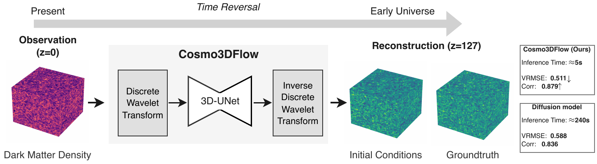
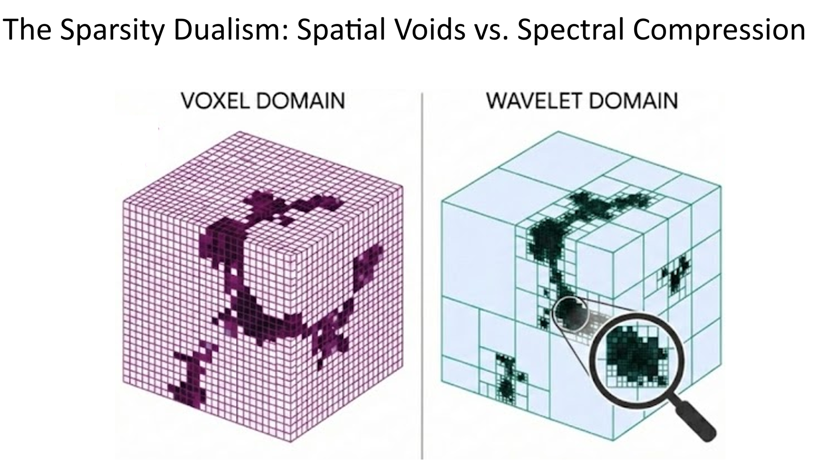
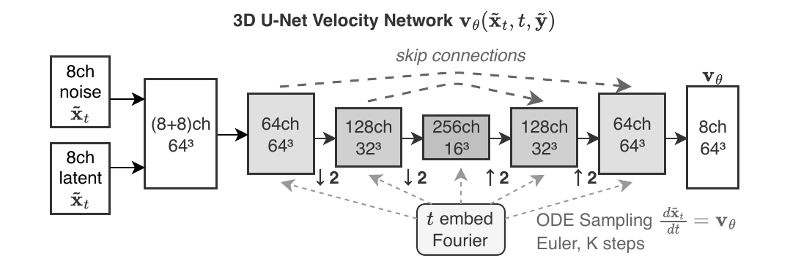
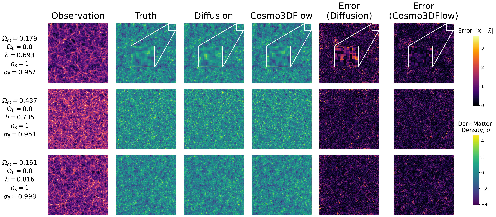
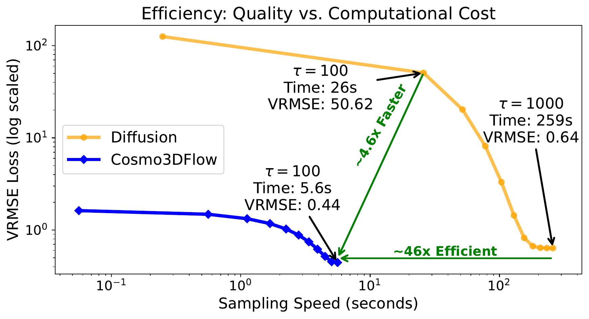
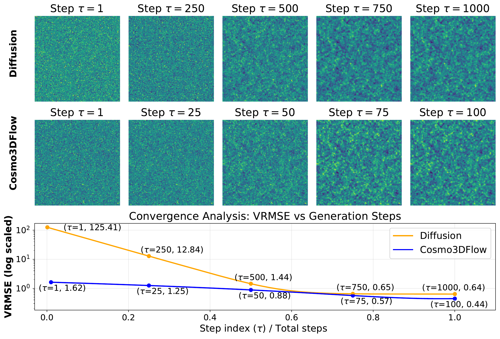
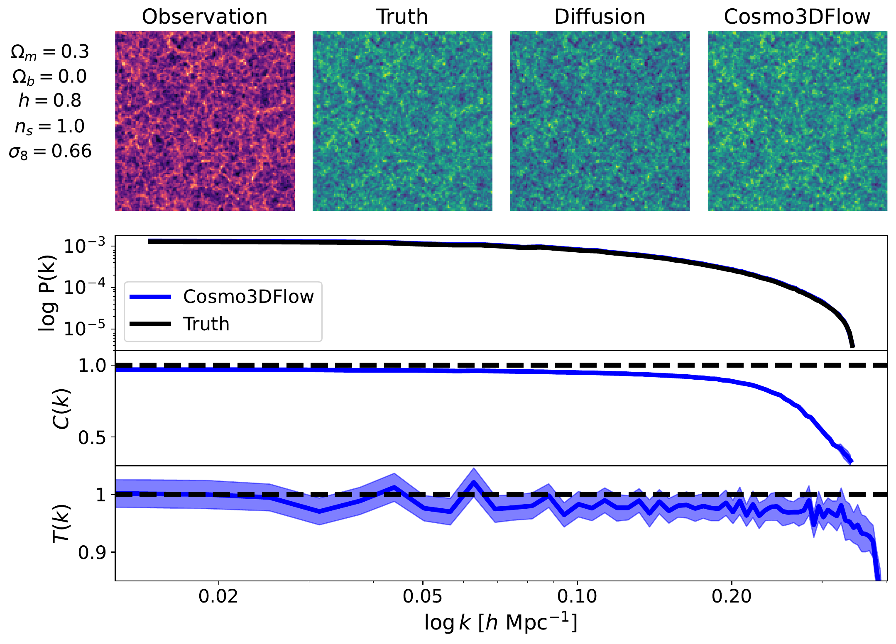

# Cosmo3DFlow: Wavelet Flow Matching for Spatial-to-Spectral Compression in Reconstructing the Early Universe

[](https://kdd2026.kdd.org/ai4sciences-track-call-for-papers/)
[](https://arxiv.org/abs/2602.10172)
[](LICENSE)
[](https://python.org)

> **KDD '26** · ACM SIGKDD · August 9–13, 2026 · Jeju, Republic of Korea

```bibtex
@inproceedings{10.1145/3770855.3818994,
author = {Islam, Md. Khairul and Xia, Zeyu and Goudjil, Ryan and Wang, Jialu and Farahi, Arya and Fox, Judy},
title = {Cosmo3DFlow: Wavelet Flow Matching for Spatial-to-Spectral Compression in Reconstructing the Early Universe},
year = {2026},
isbn = {9798400722592},
publisher = {Association for Computing Machinery},
address = {New York, NY, USA},
url = {https://doi.org/10.1145/3770855.3818994},
doi = {10.1145/3770855.3818994},
booktitle = {Proceedings of the 32nd ACM SIGKDD Conference on Knowledge Discovery and Data Mining V.2},
pages = {11153–11164},
numpages = {12},
keywords = {generative models, wavelet representation, spatial sparsity, spectral sparsity, flow matching, astronomy},
location = {Republic of Korea},
series = {KDD '26}
}
```

---

## Contents

- [Cosmo3DFlow: Wavelet Flow Matching for Spatial-to-Spectral Compression in Reconstructing the Early Universe](#cosmo3dflow-wavelet-flow-matching-for-spatial-to-spectral-compression-in-reconstructing-the-early-universe)
  - [Contents](#contents)
  - [Overview](#overview)
  - [The Void Problem](#the-void-problem)
  - [Method](#method)
    - [Wavelet Flow Matching](#wavelet-flow-matching)
    - [Wavelet-Aware 3D U-Net](#wavelet-aware-3d-u-net)
    - [Training](#training)
  - [Dataset](#dataset)
  - [Experiments](#experiments)
    - [Qualitative Reconstruction](#qualitative-reconstruction)
    - [Computational Efficiency](#computational-efficiency)
    - [Convergence](#convergence)
    - [Physics Validation](#physics-validation)
    - [Quantitative Results](#quantitative-results)
      - [Table 2 — Standard Latin Hypercube (2,000 simulations)](#table-2--standard-latin-hypercube-2000-simulations)
      - [Table 3 — Big Sobol Sequence (1,000 simulations)](#table-3--big-sobol-sequence-1000-simulations)
      - [Table 4 — Non-Gaussian fNL LH (1,000 simulations)](#table-4--non-gaussian-fnl-lh-1000-simulations)
  - [Installation](#installation)
  - [Acknowledgments](#acknowledgments)

---

## Overview

Cosmo3DFlow reconstructs early-Universe initial conditions from present-day observations using **3D Wavelet Flow Matching** — operating entirely in wavelet space for a **50× speedup** over diffusion baselines.

- **50×** faster sampling than score-based diffusion (5.2 s vs. 243 s at 128³)
- **8×** spatial compression via single-level 3D Haar DWT
- **10×** fewer ODE steps · **2× less memory** · better reconstruction quality

<p align="center">
  
</p>

---

## The Void Problem

~**63.7%** of cosmic volume is empty voids holding only **16.2%** of dark matter mass — yet voxel-space models spend equal compute everywhere. The 3D DWT converts spatial emptiness into spectral sparsity, concentrating compute on physically meaningful filaments and halos.

<p align="center">
  <em><strong>Fig. 1 — Voxel vs. wavelet representation of the cosmic web.</strong> Left: a voxel grid distributes compute uniformly across all 2.1 M cells at 128³, despite ~63.7% being near-empty cosmic voids. Right: a single-level 3D Haar DWT makes sparsity explicit — voids collapse to near-zero high-frequency coefficients, while filaments and dark matter halos retain rich fine-grained detail. This 8× spatial compression is the foundation of Cosmo3DFlow's efficiency gains.</em>
  <br><br>
  
</p>

---

## Method

### Wavelet Flow Matching

Flow matching trained entirely in wavelet space: apply 3D Haar DWT → interpolate the flow path → train with a flow + power-spectrum loss → integrate 100 Euler steps → IDWT to recover the density field.

### Wavelet-Aware 3D U-Net

<p align="center">
  <em><strong>Fig. 2 — Wavelet-aware 3D U-Net.</strong> A 16-channel input (8ch wavelet noise + 8ch conditioned observation) passes through encoder–decoder blocks with a fixed 8³ bottleneck. Scale-specific conditioning injects per-level wavelet features at each resolution via 1×1×1 convolutions. Cross-scale skip connections bridge encoder features to non-corresponding decoder levels, enabling multi-scale information flow beyond a standard U-Net.</em>
  <br><br>
  
</p>

- **Scale-specific conditioning** — per-level wavelet features injected via 1×1×1 convolutions
- **Cross-scale skip connections** — encoder features bridged to non-corresponding decoder levels
- **BigGAN residual blocks** — GroupNorm · SiLU · Gaussian Fourier time embeddings
- **Fixed 8³ bottleneck** — 2 / 3 / 4 encoder levels for 32³ / 64³ / 128³

### Training

```
Optimizer: AdamW  lr=1e-4  |  Grad clip: 1.0  |  EMA: 0.999
Schedule:  ReduceLROnPlateau (patience=5, factor=0.5)
Epochs:    100 (best val-loss)  |  Batch: 16 / 8 / 4  (32³/64³/128³)
Hardware:  NVIDIA A100 80 GB
```

---

## Dataset

Three [Quijote N-body](https://quijote-simulations.readthedocs.io/en/latest/LH.html) suites · (1000 h⁻¹ Mpc)³ boxes · 512³ particles · fields at 32³, 64³, 128³

| Suite | Simulations | Split |
|---|---|---|
| Standard Latin Hypercube (LH) | 2,000 | 1800 / 100 / 100 |
| Big Sobol Sequence (BSQ) | 1,000 | 8:1:1 |
| Non-Gaussian fNL LH | 1,000 | 8:1:1 |

---

## Experiments

### Qualitative Reconstruction

<p align="center">
  <em><strong>Fig. 3 — Qualitative reconstruction at z = 127.</strong> Each row shows a 2D slice from a held-out Standard LH test simulation. Columns (left to right): present-day observation (z = 0), ground-truth initial conditions, diffusion baseline, Cosmo3DFlow reconstruction, and absolute error maps (darker = lower error). Cosmo3DFlow recovers sharp cosmic filaments and halo positions that the diffusion baseline blurs, achieving a 21% lower VRMSE at 128³.</em>
  <br><br>
  
</p>

### Computational Efficiency

<p align="center">
  <em><strong>Fig. 4 — Sampling efficiency vs. reconstruction accuracy at 128³.</strong> Each point plots VRMSE against wall-clock sampling time for varying ODE step counts. Cosmo3DFlow (blue) is 4.4× faster per step due to 8× wavelet compression, and converges to lower VRMSE at just 100 steps than diffusion achieves at 1,000 — yielding a 50× end-to-end speedup (5.2 s vs. 243 s) with better quality.</em>
  <br><br>
  
</p>

**Table 1 — Head-to-head comparison at 128³**

| | Cosmo3DFlow | Diffusion |
|---|---|---|
| Sampling time @ 128³ | **5.2 s** | 243 s |
| Peak memory @ 128³ | **2.1 GB** | 4.0 GB |
| ODE steps | **100** | 1,000 |

### Convergence

<p align="center">
  <em><strong>Fig. 5 — Convergence vs. number of ODE integration steps.</strong> Top: reconstructed density field slices at 10, 50, 100, and 500 steps. Bottom: VRMSE as a function of step count (lower = better). Cosmo3DFlow (blue) reaches its best reconstruction quality at 100 Euler steps and plateaus; the diffusion baseline (red) requires 1,000 steps to approach a higher error floor. The deterministic ODE trajectory in flat wavelet space enables stable large-step integration without quality degradation.</em>
  <br><br>
  
</p>

### Physics Validation

<p align="center">
  <em><strong>Fig. 6 — Statistical physics metrics on the Standard LH test set at 128³.</strong> Each panel plots a statistic vs. wavenumber k. <em>Top:</em> power spectrum P(k) — energy distribution across spatial scales; <em>middle:</em> cross-correlation C(k) between predicted and true density fields; <em>bottom:</em> transfer function T(k). Cosmo3DFlow (blue) achieves near-perfect agreement with ground truth (dashed) across all scales, while diffusion (red) degrades at high k. PS R² = 0.99 vs. 0.70 for diffusion.</em>
  <br><br>
  
</p>

### Quantitative Results

<details>
<summary>Tables 2–4: All datasets × resolutions (Ours / Diffusion · <strong>bold = best</strong>)</summary>

#### Table 2 — Standard Latin Hypercube (2,000 simulations)

| Resolution | VRMSE ↓ | Corr ↑ | PS R² ↑ | Transfer Fn ↑ |
|---|---|---|---|---|
| 128³ | **0.50** / 0.63 | **0.88** / 0.82 | **0.99** / 0.70 | **0.99** / 0.80 |
| 64³  | **0.47** / 0.68 | **0.92** / 0.89 | **0.98** / 0.59 | **0.98** / 0.59 |
| 32³  | **0.34** / 0.82 | **0.96** / 0.85 | **0.95** / 0.48 | **0.95** / 0.48 |

#### Table 3 — Big Sobol Sequence (1,000 simulations)

| Resolution | VRMSE ↓ | Corr ↑ | PS R² ↑ | Transfer Fn ↑ |
|---|---|---|---|---|
| 128³ | **0.62** / 0.64 | **0.80** / 0.79 | **0.99** / 0.84 | **0.95** / 0.88 |
| 64³  | **0.53** / 0.65 | 0.88 / 0.88 | **0.98** / 0.83 | **0.94** / 0.81 |
| 32³  | **0.37** / 0.79 | **0.95** / 0.85 | **0.95** / 0.48 | **0.94** / 0.71 |

#### Table 4 — Non-Gaussian fNL LH (1,000 simulations)

| Resolution | VRMSE ↓ | Corr ↑ | PS R² ↑ | Transfer Fn ↑ |
|---|---|---|---|---|
| 128³ | **0.56** / 0.59 | **0.86** / 0.83 | 1.00 / 1.00 | 0.98 / 0.98 |
| 64³  | **0.47** / 0.57 | **0.93** / 0.89 | 1.00 / 1.00 | 0.99 / 0.99 |
| 32³  | **0.31** / 0.67 | **0.97** / 0.87 | **1.00** / 0.98 | **0.99** / 0.98 |

</details>

---

## Installation

```bash
git clone https://github.com/khairul-me/Cosmo3DFlow.git
cd Cosmo3DFlow
pip install -r requirements.txt
```

---

## Acknowledgments

We acknowledge support from the **National Science Foundation** under Cooperative Agreement 2421782 and the **Simons Foundation** award MPS-AI-00010515 and Seed Grant AWD-006703 (UVA00002858-AS-ASTR-NSF Simons CosmicAI). We thank the Quijote team for making their 𝑁 -body suite publicly available. We are grateful for the UVA Research Computing resources and support. 

*University of Virginia · University of Texas at Austin*   

<p align="center">
  
  &nbsp;&nbsp;&nbsp;&nbsp;
  
  &nbsp;&nbsp;&nbsp;&nbsp;
    
  &nbsp;&nbsp;&nbsp;&nbsp;
  
</p>
